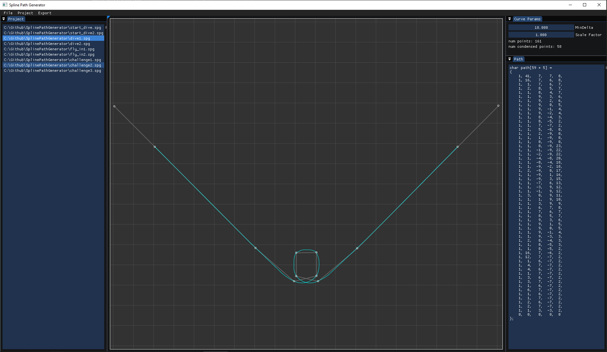

# SplinePathGenerator
 Utility for creating paths (points and directions) along Catmull-Rom spline curves.
 
 Use the mouse to place and move points. Initial two points are created by clicking and dragging, subsequent points are just a single click where you want it.
 Click and drag existing points to move them, and right click for a context menu to remove the hovered point, the last point or all points.

 
 
 Paths consist of 5 values per entry.
|command|command_data|deltaX|deltaY|rotation|description|
|-------|------------|------|------|--------|-----------|
| 1 |repeat|X|Y|0-23|move entity by X,Y repreat times, with rotation 0-23|
| 2 |path index| 0 | 0 | 0 |gosub to another path|
| 0 | 1 | 0 | 0 | 0 |return from a gosub|
| 0 | 0 | 0 | 0 | 0 |end of path|
